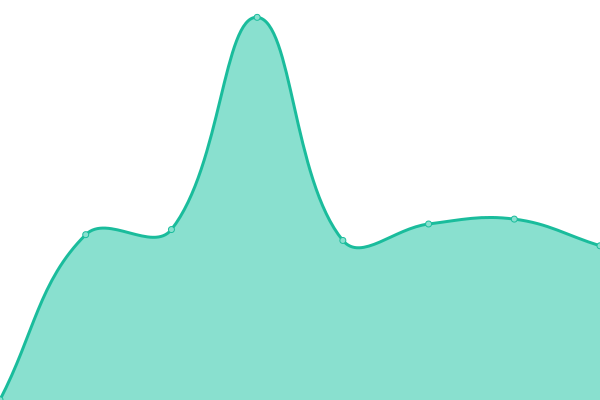

# [📈 Live Status](https://Dehaat.github.io/upptime): <!--live status--> **🟧 Partial outage**

This repository contains the open-source uptime monitor and status page for [Dehaat](http://www.agrevolution.in/), powered by [Upptime](https://github.com/upptime/upptime).

With [Upptime](https://upptime.js.org), you can get your own unlimited and free uptime monitor and status page, powered entirely by a GitHub repository. We use [Issues](https://github.com/Dehaat/upptime/issues) as incident reports, [Actions](https://github.com/Dehaat/upptime/actions) as uptime monitors, and [Pages](https://Dehaat.github.io/upptime) for the status page.

<!--start: status pages-->
<!-- This summary is generated by Upptime (https://github.com/upptime/upptime) -->
<!-- Do not edit this manually, your changes will be overwritten -->
<!-- prettier-ignore -->
| URL | Status | History | Response Time | Uptime |
| --- | ------ | ------- | ------------- | ------ |
|  [Geography](https://aeros.api.agrevolution.in/admin/login/?next=/admin/) | 🟩 Up | [geography.yml](https://github.com/Dehaat/uptime/commits/HEAD/history/geography.yml) | 

 823ms
     
 | 

<a href="https://status.agrevolution.in/history/geography">100.00%</a>
    

|  [Kheti](https://kheti.api.agrevolution.in/admin/login/?next=/admin/) | 🟩 Up | [kheti.yml](https://github.com/Dehaat/uptime/commits/HEAD/history/kheti.yml) | 

 1633ms
     
 | 

<a href="https://status.agrevolution.in/history/kheti">99.29%</a>
    

|  [Mailman](https://mailman.api.agrevolution.in/admin/login/?next=/admin/) | 🟩 Up | [mailman.yml](https://github.com/Dehaat/uptime/commits/HEAD/history/mailman.yml) | 

 924ms
     
 | 

<a href="https://status.agrevolution.in/history/mailman">99.31%</a>
    

|  [Ticketmaster](https://ticketmaster.api.agrevolution.in/admin/login/?next=/admin/) | 🟩 Up | [ticketmaster.yml](https://github.com/Dehaat/uptime/commits/HEAD/history/ticketmaster.yml) | 

 1019ms
     
 | 

<a href="https://status.agrevolution.in/history/ticketmaster">99.61%</a>
    

|  [Locus](https://locus.api.dehaatagri.com/admin/login/?next=/admin/) | 🟩 Up | [locus.yml](https://github.com/Dehaat/uptime/commits/HEAD/history/locus.yml) | 

 835ms
     
 | 

<a href="https://status.agrevolution.in/history/locus">100.00%</a>
    

|  [Output Marketplace](https://output.api.agrevolution.in/) | 🟥 Down | [output-marketplace.yml](https://github.com/Dehaat/uptime/commits/HEAD/history/output-marketplace.yml) | 

 890ms
     
 | 

<a href="https://status.agrevolution.in/history/output-marketplace">100.00%</a>
    

|  [Rancher](https://rancher.agrevolution.in) | 🟩 Up | [rancher.yml](https://github.com/Dehaat/uptime/commits/HEAD/history/rancher.yml) | 

 1187ms
     
 | 

<a href="https://status.agrevolution.in/history/rancher">100.00%</a>
    

<!--end: status pages-->

[**Visit our status website →**](https://Dehaat.github.io/uptime)

## 📄 License

- Powered by: [Upptime](https://github.com/upptime/upptime)
- Code: [MIT](./LICENSE) © [Dehaat](http://www.agrevolution.in/)
- Data in the `./history` directory: [Open Database License](https://opendatacommons.org/licenses/odbl/1-0/)
